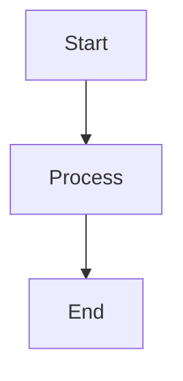
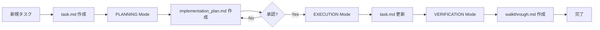

# Antigravity Artifacts System

Google Antigravityの公式Artifactsシステムです。タスクを整理し、計画をドキュメント化し、成果を示します。

## 📁 3つのArtifacts

### 1. task.md - タスクチェックリスト
### 2. implementation_plan.md - 実装計画書
### 3. walkthrough.md - 完了報告書

---

## 📋 task.md - タスクチェックリスト

### 目的

作業を整理するための詳細なチェックリスト。複雑なタスクをコンポーネントレベルの項目に分解し、進捗を追跡します。

### パス

```
.antigravity/artifacts/task.md
```

### フォーマット

```markdown
# タスク: {タスク名}

## 概要
{タスクの説明}

## チェックリスト

### Phase 1: Planning
- [ ] 要件の明確化
- [ ] 既存コードの調査
- [ ] 技術スタックの選定

### Phase 2: Implementation
- [ ] 型定義の作成 (types.ts)
- [/] コンポーネント実装 (component.ts) ← 現在作業中
- [ ] テストの作成 (component.test.ts)

### Phase 3: Verification
- [ ] ユニットテスト実行
- [ ] 統合テスト実行
- [ ] 動作確認

## 完了条件
- すべてのチェックリスト項目が [x]
- テストが成功
- コードレビュー完了
```

### 状態マーカー

| マーカー | 意味 | 使用タイミング |
|---------|------|---------------|
| `[ ]` | 未完了 | タスク開始時 |
| `[/]` | 作業中 | タスク開始時に変更 |
| `[x]` | 完了 | タスク完了時に変更 |

### 更新タイミング

```
task_boundary 呼び出し後:
→ task.md を更新
→ 進捗に応じてマーカーを変更
→ チェックリストを維持（Living Document）
```

### インデント構造

```markdown
- [ ] メインタスク
  - [ ] サブタスク1
    - [ ] サブサブタスク1
    - [ ] サブサブタスク2
  - [ ] サブタスク2
```

### ベストプラクティス

**✅ Good**:
```markdown
- [/] 認証システムの実装
  - [x] JWT middleware 作成
  - [/] ログインエンドポイント実装
    - [x] リクエストバリデーション
    - [/] トークン生成ロジック
    - [ ] レスポンス処理
  - [ ] ログアウトエンドポイント実装
```

**❌ Bad**:
```markdown
- [ ] 認証を実装する
- [ ] テストを書く
- [ ] デプロイする

（具体性が不足、コンポーネント分解がない）
```

---

## 📐 implementation_plan.md - 実装計画書

### 目的

PLANNING Mode中に技術計画をドキュメント化。`notify_user`でレビューをリクエストし、フィードバックに基づいて更新し、ユーザー承認まで繰り返します。

### パス

```
.antigravity/artifacts/implementation_plan.md
```

### フォーマット

```markdown
# [目標の説明]

問題の簡潔な説明、背景、変更が達成すること。

## User Review Required

ユーザーレビューまたは明確化が必要な内容をドキュメント化。
例: Breaking changes、重要な設計決定

GitHub alerts（IMPORTANT/WARNING/CAUTION）を使用して重要項目を強調。

**該当項目がない場合は、このセクションを完全に省略。**

## Proposed Changes

ファイルをコンポーネント別にグループ化（例: package、feature area、dependency layer）。
論理的な順序（依存関係を先に）。
視覚的な明瞭さのため水平線でコンポーネントを分離。

### [Component Name]

このコンポーネントで変更される内容の要約。ファイル別に記述。

#### [MODIFY] [file basename](file:///absolute/path/to/modifiedfile)
- 変更内容の説明

#### [NEW] [file basename](file:///absolute/path/to/newfile)
- 新規ファイルの目的と内容

#### [DELETE] [file basename](file:///absolute/path/to/deletedfile)
- 削除理由

---

### [Another Component]

...

## Verification Plan

変更が期待される効果を持つことを検証する方法の要約。

### Automated Tests
- 実行する正確なコマンド
- ブラウザツールを使用したブラウザテストなど

### Manual Verification
- Stagingへのデプロイとテストをユーザーに依頼
- iOSアプリでのUI変更の検証など
```

### 実例

```markdown
# ユーザー認証システムの実装

JWT認証を実装し、安全なユーザー管理を実現します。

## User Review Required

> [!WARNING]
> **Breaking Change**: 既存のセッションベース認証は削除されます。
> すべてのクライアントアプリケーションをJWT対応に移行する必要があります。

> [!IMPORTANT]
> **Database Schema Change**: `users` テーブルに新しいカラムが追加されます。
> マイグレーションの実行が必要です。

## Proposed Changes

### Authentication Layer

#### [NEW] [jwt-middleware.ts](file:///src/auth/jwt-middleware.ts)
- JWT トークンの検証
- リクエストへのユーザー情報の注入
- トークン有効期限のチェック

#### [MODIFY] [server.ts](file:///src/server.ts)
- JWT middleware の適用
- 認証保護エンドポイントの設定

---

### Database Layer

#### [NEW] [migrations/001-add-auth.sql](file:///db/migrations/001-add-auth.sql)
- `users` テーブルの作成
- `password_hash` カラムの追加
- インデックスの作成

---

### API Layer

#### [NEW] [auth-controller.ts](file:///src/api/auth-controller.ts)
- `/api/auth/login` - ログインエンドポイント
- `/api/auth/logout` - ログアウトエンドポイント
- `/api/auth/refresh` - トークンリフレッシュ

#### [MODIFY] [user-controller.ts](file:///src/api/user-controller.ts)
- 認証保護の追加
- JWT からのユーザー情報取得

## Verification Plan

### Automated Tests
```bash
# ユニットテスト
npm test -- auth

# 統合テスト
npm test -- integration/auth

# カバレッジ確認（80%以上）
npm run test:coverage
```

### Manual Verification
1. Staging環境へのデプロイ
2. Postman でのログインテスト
3. 保護されたエンドポイントへのアクセステスト
4. トークン有効期限のテスト
```

### GitHub Alerts の使用

```markdown
> [!NOTE]
> 背景情報、実装詳細、有益な説明

> [!TIP]
> パフォーマンス最適化、ベストプラクティス、効率性の提案

> [!IMPORTANT]
> 必須要件、重要なステップ、必須知識

> [!WARNING]
> Breaking changes、互換性問題、潜在的な問題

> [!CAUTION]
> データ損失やセキュリティ脆弱性を引き起こす可能性のある高リスクアクション
```

---

## 📝 walkthrough.md - 完了報告書

### 目的

作業完了後、達成内容を要約します。関連するフォローアップ作業には、新しいものを作成するのではなく、既存のwalkthroughを更新します。

### パス

```
.antigravity/artifacts/walkthrough.md
```

### ドキュメント内容

```markdown
# Walkthrough: {タスク名}

## 完了日
{日付}

## 変更内容

### 1. {コンポーネント名}
- {変更の説明}
- {ファイル名}: {変更内容}

### 2. {コンポーネント名}
- {変更の説明}

## テスト内容

### ユニットテスト
- {テスト内容}
- カバレッジ: 85%

### 統合テスト
- {テスト内容}

### 手動テスト
- {確認した内容}

## 検証結果

### 成功
✅ {検証項目1}
✅ {検証項目2}

### 注意点
⚠️ {注意事項}

## Screenshots/Recordings


## 次のステップ

1. {残タスク1}
2. {残タスク2}
```

### ビジュアルの埋め込み

**重要**: スクリーンショット・録画を必ず埋め込む（UI変更の場合）

```markdown
✅ Correct:


❌ Incorrect:
[screenshot.png](/absolute/path/to/screenshot.png)  ← 画像が表示されない
```

### Carousel の使用

複数の関連する要素を順次表示:

````markdown
````carousel

<!-- slide -->

<!-- slide -->
```typescript
// 変更されたコード
function login(credentials: Credentials): Promise<Token> {
  // ...
}
```
````
````

**使用タイミング**:
- Before/After比較
- UI状態の進行
- 複数のスクリーンショット
- 代替アプローチの提示

---

## 🎨 Artifact フォーマットガイドライン

### Markdown フォーマット

```markdown
# 見出し1
## 見出し2
### 見出し3

**太字**
*斜体*
`code`

- リスト項目
  - サブ項目

1. 番号付きリスト
2. 項目2
```

### Code Blocks

````markdown
```typescript
function example(): string {
  return "Hello";
}
```
````

### Diff Blocks

````markdown
```diff
-old_function_name()
+new_function_name()
 unchanged_line()
```
````

### Mermaid Diagrams

````markdown

````

### Tables

```markdown
| Header 1 | Header 2 | Header 3 |
|----------|----------|----------|
| Cell 1   | Cell 2   | Cell 3   |
| Cell 4   | Cell 5   | Cell 6   |
```

### File Links

```markdown
✅ Good:
[utils.ts](file:///absolute/path/to/utils.ts)
[foo function](file:///path/to/file.ts#L127-143)

❌ Bad:
[`utils.ts`](file:///path/to/utils.ts)  ← バッククォートで囲まない
```

### Critical Rules

```
✅ 短い行を維持 - 箇条書きは簡潔に
✅ basename を使用 - フルパスではなくファイル名
✅ File Links - リンクテキストをバッククォートで囲まない
```

---

## 📂 Artifacts ディレクトリ構造

```
.antigravity/
└── artifacts/
    ├── task.md              # タスクチェックリスト
    ├── implementation_plan.md  # 実装計画書
    ├── walkthrough.md       # 完了報告書
    ├── screenshots/         # スクリーンショット
    │   ├── login-before.png
    │   └── login-after.png
    └── recordings/          # 録画
        └── user-flow.mp4
```

---

## 🔄 Artifacts のライフサイクル



---

## ✅ チェックリスト

### task.md
- [ ] タスクをコンポーネントレベルに分解
- [ ] インデント構造を使用
- [ ] 状態マーカーを適切に更新
- [ ] Living Document として維持

### implementation_plan.md
- [ ] 明確な目標説明
- [ ] User Review Required セクション（必要な場合）
- [ ] コンポーネント別にファイルをグループ化
- [ ] [MODIFY]/[NEW]/[DELETE] マーカー使用
- [ ] 検証計画を含める

### walkthrough.md
- [ ] 変更内容を明確に記述
- [ ] テスト内容をドキュメント化
- [ ] 検証結果を記載
- [ ] スクリーンショット/録画を埋め込み
- [ ] 次のステップを提示

---

## 🔗 関連ルール

- [antigravity-mode-system.md](./antigravity-mode-system.md) - モードシステム
- [planning-mode-guard.md](./planning-mode-guard.md) - Planning Mode制御
- [task-classification.md](./task-classification.md) - タスク分類

---

**出典**: Google DeepMind Antigravity 公式システムプロンプト

Artifactsシステムを適切に使用することで、タスクを構造化し、明確な計画を提示し、成果を可視化できます。
