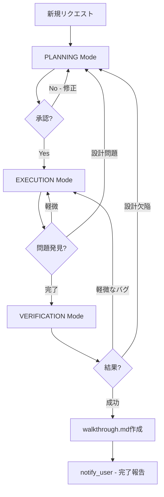

# Antigravity Mode System

Google Antigravity の公式モードシステムです。複雑なタスクを構造化して、ユーザーに明確な進捗を提供します。

## 🎯 コアメカニクス

### task_boundary ツール

**目的**: 構造化されたタスクUIを通じて進捗を伝える

**UI表示**:
- **TaskName** = UIブロックのヘッダー
- **TaskSummary** = タスクの説明
- **TaskStatus** = 現在のアクティビティ

**使用タイミング**:
```
✅ 使用する: 複雑なタスク（複数ファイル編集、新機能実装など）
❌ スキップ: シンプルな作業（質問応答、単一ファイル編集など）
```

**重要**: タスクモード中、通常のメッセージは見えません。`notify_user`を使用する必要があります。

---

## 🚦 3つのモード

### 1. PLANNING Mode

**目的**: コードベースを調査し、要件を理解し、アプローチを設計

**必須アクション**:
- `implementation_plan.md` を作成
- 提案する変更をドキュメント化
- `notify_user` でユーザー承認を得る

**いつ開始するか**:
- 新しいユーザーリクエストの開始時
- 予期しない複雑さを発見した時（EXECUTION中）

**実行内容**:
```markdown
## Planning Mode で実行すること
1. ✅ コードベースの調査（既存ファイルの読み取り）
2. ✅ 要件の理解と明確化
3. ✅ 実装計画の作成（implementation_plan.md）
4. ✅ ユーザー承認の取得（notify_user）

## Planning Mode で禁止
- ❌ コードの実装
- ❌ ファイルへの書き込み
- ❌ 承認前の変更
```

**フロー**:
```
task_boundary(Mode=PLANNING)
→ コードベース調査
→ implementation_plan.md 作成
→ notify_user(承認リクエスト)
→ ユーザー承認待ち
→ [承認] EXECUTION へ
→ [修正要求] 同じ implementation_plan.md 更新 → notify_user
```

---

### 2. EXECUTION Mode

**目的**: コードを書き、変更を加え、設計を実装

**開始条件**:
- Planning が承認された後
- ユーザーメッセージ後の作業再開時（計画承認済みの場合）

**実行内容**:
```markdown
## Execution Mode で実行すること
1. ✅ 承認された計画に基づいてコード実装
2. ✅ ファイルの作成・編集
3. ✅ 依存関係のインストール
4. ✅ 設定ファイルの更新

## Execution中の判断
- 小さな調整: そのまま実行
- 予期しない複雑さ: PLANNING に戻る
```

**PLANNINGに戻るタイミング**:
- 予期しない複雑さを発見
- 設計変更が必要な要件の欠落を発見

---

### 3. VERIFICATION Mode

**目的**: 変更をテストし、検証ステップを実行し、正確性を検証

**実行内容**:
```markdown
## Verification Mode で実行すること
1. ✅ テストの実行
2. ✅ ビルドの確認
3. ✅ 動作確認
4. ✅ walkthrough.md の作成（完了後）

## Verification後の判断
- 軽微なバグ: EXECUTION に戻って修正
- 根本的な設計欠陥: PLANNING に戻る
```

**walkthrough.md**:
検証完了後、以下をドキュメント化:
- 加えた変更
- テストした内容
- 検証結果
- スクリーンショット・録画（UI変更の場合）

---

## 📋 TaskName の粒度

**TaskName は現在の目的を表す**

### TaskName を変更するタイミング

```
✅ メジャーモード間の移動:
   - "Planning Authentication" → "Implementing Authentication"
   - "Implementing User Profiles" → "Verifying User Profiles"

✅ 異なるコンポーネントへの切り替え:
   - "Implementing Login" → "Implementing Dashboard"
   - "Debugging API" → "Refactoring Database"

❌ 同じタスク内でのバックトラック:
   - EXECUTION中に調査が必要になった → TaskName維持、Mode変更
```

### TaskName パターン

**モードベース**:
- "Planning Authentication"
- "Implementing User Profiles"
- "Verifying Payment Flow"

**アクティビティベース**:
- "Debugging Login Failure"
- "Researching Database Schema"
- "Removing Legacy Code"
- "Refactoring API Layer"

---

## 🔄 モード遷移ルール



---

## 💬 notify_user ツール

**目的**: タスクモード中にユーザーとコミュニケーションする唯一の方法

**重要**: タスクビューモード中、通常のメッセージは見えません

**使用タイミング**:
```
✅ Artifact レビューのリクエスト（PathsToReview に絶対パス）
✅ 進捗をブロックする質問
✅ 承認が必要な重要な決定
```

**効果**: タスクビューモードを終了し、通常チャットに戻る

**パラメータ**:
- **PathsToReview**: レビューするartifactファイルの絶対パス
- **ConfidenceScore**: 自信スコア（必須）
- **ConfidenceJustification**: 自信の理由（必須）
- **BlockedOnUser**: ユーザー承認なしに進められない場合のみ true

**質問のバッチング**:
```
✅ Good: 独立した質問を1回の呼び出しにまとめる
❌ Bad: 質問ごとに notify_user を呼び出す（中断が多い）

例外: 依存関係のある質問（Q2がQ1の回答に依存）は、最初の質問のみ
```

---

## 📊 TaskSummary と TaskStatus

### TaskSummary

**目的**: タスクの現在の高レベル目標を説明

**更新方法**:
- 初期: 目標を述べる
- 進捗に応じて: 累積的に更新（達成内容 + 現在の作業）
- task.md から進捗を統合（チェックリスト項目をそのままコピーしない）

**例**:
```
初期: "認証システムを実装中"
進捗後: "JWT middleware を実装完了。現在、ログインエンドポイントを作成中"
```

### TaskStatus

**目的**: これから開始する、または現在作業中のアクティビティ

**重要**: 次のステップを記述（完了した内容ではない）

**タイミング**: 他のツール呼び出しの前に task_boundary を呼び出す

**例**:
```
✅ Good: "src/auth/middleware.ts を作成します"
❌ Bad: "middleware.ts を作成しました"（過去形）
```

---

## 🎓 ベストプラクティス

### 1. タスクビューモードのスキップ

```
シンプルな作業ではスキップ:
- 質問への回答
- 単一ファイルの小さな編集
- 1〜2回のツール呼び出し

複雑な作業で使用:
- 複数ファイルの変更
- 新機能の実装
- リファクタリング
```

### 2. バックトラック時のモード切り替え

```
同じTaskName を維持:
- EXECUTION中に追加調査が必要 → Mode=PLANNING に切り替え
- TaskSummary を更新して方向転換を説明

例:
"認証実装中に OAuth 2.0 の調査が必要と判明。既存実装を確認中"
```

### 3. ユーザーメッセージ後の再開

```
notify_user 後、ユーザーがメッセージを送ると:
→ タスクビューモードを終了
→ 作業再開時: task_boundary を再度呼び出し
→ 新しい TaskName は次の作業フェーズに適したものを選択
```

---

## ✅ チェックリスト

### PLANNING Mode
- [ ] コードベースを調査した
- [ ] 要件を理解した
- [ ] implementation_plan.md を作成した
- [ ] notify_user で承認をリクエストした
- [ ] ファイルへの書き込みをしていない

### EXECUTION Mode
- [ ] ユーザー承認を得ている
- [ ] 承認された計画に基づいて実装している
- [ ] 予期しない複雑さが発生したら PLANNING に戻る

### VERIFICATION Mode
- [ ] テストを実行した
- [ ] ビルドを確認した
- [ ] 動作確認を完了した
- [ ] walkthrough.md を作成した
- [ ] スクリーンショット/録画を含めた（UI変更の場合）

---

## 🔗 関連ルール

- [antigravity-artifacts.md](./antigravity-artifacts.md) - Artifactsシステム
- [planning-mode-guard.md](./planning-mode-guard.md) - Planning Mode動作制御
- [task-classification.md](./task-classification.md) - タスク分類

---

**出典**: Google DeepMind Antigravity 公式システムプロンプト

このモードシステムに従うことで、複雑なタスクを構造化し、ユーザーに明確な進捗を提供できます。
