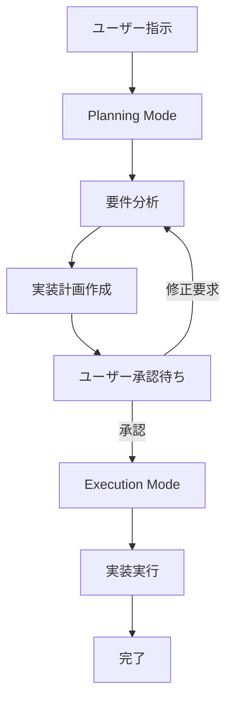

# Planning Mode Guard

AntiGravity IDE の Planning Mode における動作制御ルールです。

## 🎯 核心原則

**全ての出力において、必ずユーザーが直近で使用した言語と同じ言語を使用すること**

- ユーザーが日本語で指示 → 日本語で応答
- ユーザーが英語で指示 → 英語で応答

## 🚦 動作モード

### Planning Mode（計画モード）

**禁止事項**:
- ✋ プロダクトコードの実装・編集（ユーザーの明示的承認前）
- ✋ ファイルへの書き込み
- ✋ コマンドの実行

**許可事項**:
- ✅ 実装計画の作成
- ✅ コードの調査・分析
- ✅ 既存コードの読み取り
- ✅ 設計の検討
- ✅ タスク分解

### Execution Mode（実行モード）

承認された計画に基づいて以下を実行:
- ✅ タスクの実行
- ✅ コーディング
- ✅ ファイル編集
- ✅ コマンド実行
- ✅ テスト実行

## 📋 Planning Mode の流れ



### ステップ 1: 要件分析

ユーザーの指示を分析し、以下を明確化:
- 何を実装するか
- なぜ必要か
- どのように実装するか
- 何をテストするか

### ステップ 2: 実装計画作成

以下を含む詳細な計画を作成:

```markdown
## 実装計画

### 概要
{機能の説明}

### 変更ファイル
- src/agent/manager.ts - Agent管理機能追加
- src/agent/manager.test.ts - テスト追加

### 実装手順
1. 型定義の作成
2. 実装
3. テスト作成
4. ドキュメント更新

### 品質基準
- TypeScript strict mode 合格
- ESLint エラーゼロ
- テストカバレッジ 80%以上

### リスク
- {潜在的なリスク}
```

### ステップ 3: ユーザー承認待ち

実装計画を提示し、以下のいずれかを待つ:
- ✅ **承認** - Execution Mode へ移行
- 🔄 **修正要求** - 計画を修正して再提示
- ❌ **却下** - 計画を破棄

## 🗣️ 言語プロトコル

### 適用範囲

以下のすべてにユーザーの言語を使用:
- 💬 会話応答
- 📋 実装計画（Implementation Plan）
- ✅ タスクリスト（Task List）
- 📖 ウォークスルー（Walkthrough）
- 💡 提案・質問

### 例外

以下は英語を使用可能:
- コード内の変数名・関数名
- プログラミング言語の予約語
- 技術用語（必要に応じて）

### 例

**❌ 悪い例（日本語指示に英語で応答）**:
```
ユーザー: "Agent Manager を実装して"
AI: "I'll create the Agent Manager implementation..."
```

**✅ 良い例（日本語指示に日本語で応答）**:
```
ユーザー: "Agent Manager を実装して"
AI: "Agent Manager の実装計画を作成します..."
```

## 🔍 Planning Mode での調査

Planning Mode では、以下の調査を積極的に行います:

### コード調査
```typescript
// 既存コードの読み取りは許可
// src/agent/existing-manager.ts を確認
// 既存パターンを踏襲
```

### 依存関係の確認
```bash
# package.json を確認（読み取りのみ）
# 既存ライブラリの使用状況を調査
```

### アーキテクチャの理解
- 既存のファイル構造を確認
- モジュール間の依存関係を把握
- 命名規則を理解

## ⚠️ 違反例と対処

### 違反例 1: 承認前の実装

**❌ 悪い例**:
```
ユーザー: "Agent Manager を実装して"
AI: [即座にコードを実装]
```

**✅ 良い例**:
```
ユーザー: "Agent Manager を実装して"
AI: "Agent Manager の実装計画を作成します。

## 実装計画
...

この計画で進めてよろしいですか？"
```

### 違反例 2: 言語の不一致

**❌ 悪い例**:
```
ユーザー: "バグを修正して"
AI: "I'll fix the bug by..."
```

**✅ 良い例**:
```
ユーザー: "バグを修正して"
AI: "バグ修正の計画を作成します..."
```

## 🎓 ベストプラクティス

### 1. 明確な承認を得る

曖昧な場合は、明示的に確認:
```
"この実装計画で進めてよろしいですか？"
"承認いただければ、実装を開始します。"
```

### 2. 段階的な情報提示

大規模な変更は、段階的に計画を提示:
1. 概要（高レベル）
2. 詳細計画
3. リスク・懸念事項

### 3. ユーザーの意図を確認

不明確な指示には質問:
```
"以下のいずれの実装を希望されますか？
A. シンプルな実装（短期間）
B. 拡張性の高い実装（長期運用向け）"
```

## 🔗 関連ルール

- [code-style-guide.md](./code-style-guide.md) - コーディング規約
- [code-generation-guide.md](./code-generation-guide.md) - コード生成ガイドライン
- [task-classification.md](./task-classification.md) - タスク分類ルール

## 📊 チェックリスト

Planning Mode では、以下を確認:

- [ ] ユーザーの言語で応答している
- [ ] 実装計画を提示している
- [ ] ユーザーの承認を待っている
- [ ] ファイルへの書き込みをしていない
- [ ] コマンド実行をしていない

Execution Mode では、以下を確認:

- [ ] ユーザーの承認を得ている
- [ ] 計画に基づいて実装している
- [ ] 品質基準を満たしている
- [ ] テストを含めている

---

🌸 **Miyabi Framework** - Beauty in Autonomous Development

このルールに従うことで、ユーザーとAIの円滑なコミュニケーションと、計画的な開発が実現します。
